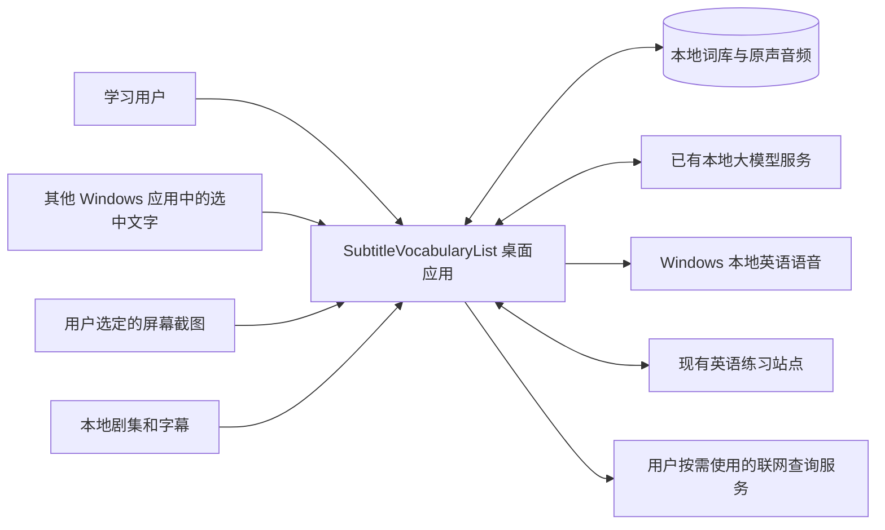

# SubtitleVocabularyList 架构设计文档

| 项目 | 内容 |
| --- | --- |
| 文档编号 | DOC-ARC-001 |
| 文档版本 | 0.18 |
| 对应产品版本 | 0.1 |
| 更新日期 | 2026-10-10 |
| 状态 | 初版待评审；技术栈与已确认约束已确定，其余设计待验证 |
| 需求依据 | [产品需求文档](../requirements/PRD.md) |
| 管理规范 | [文档管理规范](../README.md) |
| 详细设计 | [数据模型](data-model.md)、[应用流程](application-flows.md)、[接口契约](interfaces.md) |
| 实施与验证 | [开发计划](../planning/development-plan.md)、[测试计划](../testing/test-plan.md) |

本设计定义 Windows 桌面应用的技术栈、系统边界、模块职责、数据关系及集成约束。需求范围和验收标准以 PRD 为准。系统以本地词库为日常使用基础，采集、剧集导入和在线同步通过统一收录与合并逻辑连接学习核心。

## 1 设计依据与关注点

| 相关方 | 主要关注点 | 需求依据 |
| --- | --- | --- |
| 学习用户 | 离线可用、按词预习、原声复习、重复内容合并、测验与易忘词专项 | FR-01 至 FR-12、NFR-01 至 NFR-05 |
| 项目维护者 | 职责清晰、错误可定位、第三方复用可维护、需求与验证可追溯 | NFR-02、NFR-03、NFR-04 |
| 现有站点维护者 | 桌面认证、词条数据兼容、同步重试与冲突、多例句扩展 | FR-06、FR-12 |

本文提供系统上下文、模块、概念数据、主要运行流程和部署依赖视图。模块表与接口边界是初步设计；具体数据表、命令参数和实现状态在对应详细设计及验证记录中确定。

## 2 已确认架构决策

| 决策编号 | 决策 | 状态 | 依据与影响 |
| --- | --- | --- | --- |
| DEC-01 | 采用 Tauri 2、TypeScript/React、Rust、SQLite | 已确认 | 用户明确确认技术栈；界面、桌面宿主、原生核心与本地持久化各自分工 |
| DEC-02 | 独立开发应用，选择性吸收 Pot 核心实现 | 已确认 | 用户选择独立架构与有限复用；运行不依赖已安装或正在运行的 Pot |
| DEC-03 | 核心本地运行，按需连接外部服务 | 已确认 | 满足 NFR-01、NFR-04、NFR-05；本地使用不要求在线账号 |
| DEC-04 | 接入用户现有本地大模型服务，并提供 Windows 本地英语语音兜底 | 已确认 | 满足 FR-07、FR-08；模型不可用时保留基础学习流程 |
| DEC-05 | 同步对象是现有英语练习站点的在线单词本 | 已确认 | 满足 FR-12；需要兼容现有内容并扩展集成能力 |
| DEC-06 | 项目采用 GPL-3.0-only | 已确认 | 用户明确选择兼容 Pot 复用的许可；实际第三方引入分别记录来源与许可 |
| DEC-07 | 双向同步包含词条、释义、例句、原声和学习记录 | 已确认 | 用户明确选择完整同步；站点需扩展相应数据、媒体及认证接口 |

### 2.1 技术栈职责

| 技术 | 负责内容 | 实现边界 |
| --- | --- | --- |
| Tauri 2 | 桌面窗口、托盘、应用生命周期、界面与原生核心通信 | 作为宿主与连接层，业务规则集中在应用核心 |
| TypeScript/React | 候选词确认、收录窗口、词条浏览、测验与任务状态界面 | 通过明确命令访问核心，不分别维护多套合并和复习规则 |
| Rust | Windows 采集、导入任务编排、词条合并、复习规则、存储与同步适配 | 原生操作与耗时任务向界面返回结果、进度或错误 |
| SQLite | 词条、例句、来源、收录记录、学习记录、复习状态和同步元数据 | 由核心统一管理连接、事务和数据迁移 |

原声音频保存为应用管理的独立文件，数据库保存关联信息。除 Tauri 的主版本外，依赖的具体版本应在首次实现时核对、锁定并记录，本文不预设未验证的库版本。

## 3 系统上下文

剧集、截图和本地识别流程在本机完成。联网查询与站点同步由明确的用户操作或启用的设置触发，其发送字段由集成契约定义。本地大模型属于独立的本机服务，不由应用重新部署一套模型运行环境。

## 4 模块视图与依赖

0.1 采用一个桌面应用中的模块划分。采集、语言服务、媒体处理和站点接口位于边界适配层；统一收录、复习与业务状态属于应用核心。

| 模块编号 | 模块 | 职责 | 主要依赖 |
| --- | --- | --- | --- |
| ARC-01 | 桌面界面与宿主 | 主窗口、采集确认窗口、按词预习、浏览、测验和状态显示 | Tauri 通信、ARC-04、ARC-05 |
| ARC-02 | Windows 采集 | 全局触发、选中文字、截图区域、OCR 结果，处理焦点与取消 | Windows 适配、OCR 适配、ARC-04 |
| ARC-03 | 剧集导入 | 文件与文件夹任务、字幕与音轨选择、转写、时间位置、候选词整理、音频截取 | 媒体与语音识别工具、ARC-04、ARC-07 |
| ARC-04 | 词条收录与合并 | 候选确认、规范化匹配、类型与语境判断、例句与音频追加、主动收录记录 | ARC-06、ARC-07 |
| ARC-05 | 测验与复习 | 出题、作答与判分记录、复习状态、计划、易忘词专项 | ARC-04、ARC-06、ARC-07 |
| ARC-06 | 语言与播放适配 | 本地解释、可选联网查询、原声播放、Windows 语音、辅助判题 | 本地模型、音频文件、系统语音、查询服务 |
| ARC-07 | 本地数据与任务存储 | 数据事务、媒体引用、来源、任务阶段、学习历史和同步队列 | SQLite、应用数据目录 |
| ARC-08 | 站点同步 | 认证适配、增量交换、去重、冲突与失败重试 | 站点接口、ARC-04、ARC-07 |

所有采集入口通过 ARC-04 执行相同的业务规则。ARC-08 接收在线内容后也调用统一合并逻辑；同步重放与用户主动再次收录应使用可区分的操作语义。

界面与核心的命令应返回结构化成功结果或明确错误。耗时任务使用任务标识报告进度和最终状态，避免以日志或窗口事件代替操作是否成功的判断。

### 4.1 当前实施位置

当前 `desktop.rs` 连接 Tauri 与应用状态，`application.rs` 编排导入、收录和本地解释；`tasks.rs` 将业务后台快照和失败诊断写入 SQLite，日常播放、朗读、听力音频准备及解释的正常执行使用有限内存回执，取消与退出覆盖全部执行。`explanations.rs` 持久保存中文解释资料，回执淘汰不删除资料。`media.rs` 处理本地字幕、PGS OCR、转写与截取；`corpus.rs` 管理来源、候选和原声文件；`vocabulary.rs` 统一合并与持久化。React 界面通过对应命令展示预习、词库、确认和任务，不自行写数据库。

`preparation.rs` 在原生进程统一安排导入后及已有语料的后台中文准备，以 explanation_batch 持久记录整体与分集进度。可复用工作线程按配置处理项目，由一个协调线程汇总结果及进度；`model_gate.rs` 用请求许可统一限制后台和显式单项解释，默认 1，并使相同目标/完整语境的在途请求互斥，提交后复用缓存。保存配置更新运行期上限，协调线程按需增加工作线程；降低上限时等待在途工作完成，不取消已开始的请求。仅限制客户端请求，不修改外部模型服务启动参数。前端 sourceGroups/SourcePicker 按标题派生剧名、季、集选择；localExplanations 只读取已准备数据并刷新状态，不承担模型队列生命周期。退出停止原生调度，已保存资料独立于页面和任务回执保留。

后台同一句对白的候选按 sourceId 与完整原句分组，每组最多 8 个词语语境。batch_explanations.rs 一次取得共享译文和各词的词义/说明，按既有目标与完整语境身份分别保存；model_gate 按 HTTP 请求计数，并保护该批全部在途目标，避免与单项解释重复生成。该调整不更改用户模型服务的启动参数。

上述部分已有真实桌面证据，详见[桌面增量验证](../testing/desktop-import-results.md)。Windows 增量使用 `windows_native.rs` 隔离 UI Automation、SAPI 和 GDI 原生接口，`desktop_capture.rs` 管理全局触发、前台顺序和托盘生命周期，`desktop_ocr.rs` 管理截图会话与裁剪；采集结果通过统一收录核心保存。系统语音生成本地 WAV，播放沿用现有播放器。WPF 实际取词和语音证据见[Windows 记录](../testing/windows-capture-results.md)，截图证据见[OCR 记录](../testing/ocr-results.md)。`reviews.rs` 已接入私有题目快照、确定性判分和人工确认、同事务作答与修正、收录事件重放及专项列表，策略唯一来源为[策略设计](review-policy.md)。查询、同步及最终打包仍待完成。

`sync_data.rs` 已按共享字段契约导出词条和 12 类关联资料，排除设置、凭据与素材路径；当前仅有只读导出和站点初版协议，桌面完整推拉、映射、队列和冲突仍待实施。004 迁移及浏览的 contexts 读取修正同句多语境，复用原句、音频和已有历史。当前停止点及恢复方法见[笔记本交接](../development/laptop-handoff.md)。

## 5 概念数据视图

以下实体用于表达需求关系，不是最终数据库表或字段契约。

| 概念实体 | 内容与关系 | 需求依据 |
| --- | --- | --- |
| 词条 | 稳定标识、内容类型、原始文本与辅助匹配信息；关联多个例句 | FR-05、FR-06 |
| 例句与语境释义 | 原句、本次含义、用户修订；关联词条、来源和可用音频 | FR-05、FR-06、FR-07 |
| 来源与出现位置 | 素材标识、剧集或应用来源、时间位置；保留真实出现关系 | FR-01、FR-02、FR-06 |
| 音频资料 | 文件标识、类型、来源与片段位置；供例句和题目引用 | FR-07、FR-10 |
| 主动收录记录 | 用户明确收录行为与原始操作标识，区分重试和同步重放 | FR-06、FR-11、FR-12 |
| 测验记录 | 题型、能力维度、回答、提示、判分与修正关系 | FR-10、FR-11 |
| 复习状态 | 按词条或学习单元及能力维度维护的当前状态、下次安排 | FR-10、FR-11 |
| 导入任务 | 输入标识、处理阶段、结果与失败信息 | FR-01、NFR-03 |
| 同步元数据 | 操作标识、版本或游标、待同步状态与冲突信息 | FR-12 |

### 5.1 存储与一致性

- SQLite 保存结构化记录，媒体目录保存已收录原声；数据库中的媒体定位应允许整个应用数据目录迁移。
- 词条与相关资料的确认保存需要有完整结果。音频尚未保存成功时，不应把未存在的音频引用标为可播放。
- 素材与片段具有可识别的来源信息，例句和音频去重不能删除新的主动收录记录。
- 用户纠错、判分修正和复习更新保留可追溯关系。具体事务与中断恢复流程进入详细设计。
- 实际匹配键、数据库约束、删除行为和数据迁移策略在数据设计阶段确定，不能只以小写拼写替代类型与语境判断。

## 6 主要运行流程

### 6.1 剧集导入

读取素材信息、选择可用音轨和文本字幕、必要时本地转写、整理带来源的候选词、等待用户确认，再通过收录核心保存例句及原声。

文件夹任务按素材独立记录阶段与结果。用户取消或某项失败时，保留已完成和已收录内容。重复导入应识别已处理来源，用户主动再次收录仍作为不同的业务操作记录。

原字幕文字与时间位置应保留。字幕可能包含时间重叠、缺失或与音轨不一致；校正应有明确结果，不将识别或对齐失败标记为成功。

### 6.2 划词与截图

获取本次操作标识和输入，完成取词或截图裁剪与 OCR，返回本次识别结果，进入确认窗口，再执行收录。焦点与剪贴板回退属于原生适配细节，需要在支持的应用中验证。

每次操作的临时输入与结果应对应。取消、空选区、裁剪失败或 OCR 失败需要明确终止该次处理，防止固定缓存文件或旧剪贴板内容混入本次结果。

### 6.3 测验与易忘词

根据已保存复习状态选择内容，按对应维度出题，记录回答与提示，完成判分或人工修正，再更新该维度状态。专项根据失败和主动重复收录记录选择内容，并展示选择原因。

复习间隔由明确算法与规则计算。大模型提供语言解释或辅助判分；大模型不可用时仍应存在可用的基础测验与人工确认方式。

### 6.4 同步

记录本地待同步修改，完成真实站点认证后交换已定义的数据，按操作标识与来源合并，再确认处理状态。网络失败后可重试，同一操作的重试应得到幂等结果。

新增例句与学习事件按稳定标识合并，文字并发修改保留两端版本供选择，网站移除保留完整资料并要求本地归档或恢复。共同版本、账号隔离、冻结回执重试与原声传输见[同步设计](synchronization.md)；未发生业务修改的学习投影不形成回推回环。

## 7 外部接口与技术约束

### 7.1 本地大模型

- 用户提供的服务地址为 `http://127.0.0.1:8096/`。
- 接入采用其现有 OpenAI 兼容接口，模型名称按服务能力或配置确定，不假设永远固定为某个模型标识。
- 本地请求的超时、取消、并发量、结果格式和客户端兼容参数应进入适配设计并验证。
- 翻译与解释结果可缓存和修订；服务异常返回可见状态，保留候选原文。

联网查询由 `lookup.rs` 适配 Wiktionary 的英语词典与 MyMemory 的中文机器翻译，分别由明确按钮触发，不附带语境或词库。界面说明发送字段和来源，结果只作为待确认建议。默认允许联网；手动离线拒绝外网请求。Application 统一跟踪在线查询、站点连接和同步任务的连接失败，运行期降级不写入手动设置，也不阻断后续重试；本地模型 HTTP 禁用代理与重定向，保持回环服务边界，不参与外网状态判断。选择、语境、联网恢复和自动解释建议之间的状态规则见[流程设计](application-flows.md)。

### 7.2 Windows 采集与语音

当前取词使用 Windows UI Automation TextPattern，先获取选区，再显示收录窗口，不读取或改写剪贴板。只声明实际验证的支持范围；不支持的提供方、前台变化和权限问题保持失败。截图仍需验证多显示器坐标、屏幕缩放和窗口焦点，未据划词结果宣称截图兼容。[Microsoft TextPattern 文档](https://learn.microsoft.com/en-us/windows/win32/api/uiautomationclient/nn-uiautomationclient-iuiautomationtextpattern)

系统 OCR 的官方桌面支持要求应用具有包身份，通常通过 MSIX 安装。因此 OCR 引擎与打包方式需要一起评估，不能把普通安装程序下的调用行为直接当作已支持。[Windows OCR 文档](https://learn.microsoft.com/en-us/uwp/api/windows.media.ocr)

无原声时使用 Windows 已安装的英语语音。本轮 SAPI 实际生成、播放器和取消结果已记录；选择英语 token 并以明确 WAV 格式输出，保留 WaitUntilDone 的超时语义，生成结果不直接计为已播放。[Microsoft 流格式文档](https://learn.microsoft.com/en-us/previous-versions/office/developer/speech-technologies/jj149357(v=msdn.10))

### 7.3 媒体处理与转写

当前原型使用 FFmpeg 处理音轨与字幕，Tesseract 识别英语图像，`libbitsub-core` 解码 PGS，`whisper.cpp` 的英语模型执行无可用字幕时的离线转写。版本与验证边界写入实际记录；原型成功不自动代表所有格式均已验收。

已有英语练习项目的素材处理流程支持文件或文件夹输入，并生成包含 `lesson.json`、`audio.m4a`、文本和字幕的学习包。格式与处理经验可以作为导入设计参考，不能因此使桌面程序必须依赖另一个项目的安装环境。

### 7.4 现有英语练习站点

集成前提来自 2026-10-06 核对的本地站点源码，部署环境的实际能力需要另外验证：

| 当前源码行为 | 对桌面集成的影响 |
| --- | --- |
| `db/schema.ts` 的词库记录保存用户、词键、词、单条释义、单条语境和创建时间 | 需要扩展多例句与来源关系，不能用单条语境覆盖新旧收录内容 |
| `server/index.js` 提供 `/api/vocabulary` 的读取、写入和删除 | 可作为兼容入口参考，但没有完整增量同步契约 |
| 用户身份取自宿主提供的认证请求头，写入与删除校验同源 Origin | 桌面需要可验证的认证方案；自行填写身份请求头不能代替认证 |
| 当前词库模型没有原声音频和复习状态 | 已确认完整同步，需要扩展媒体、学习记录存储和接口 |

桌面账号授权、完整推拉和旧网页词库桥接已接通。当前增量完成真实双向例句、原声与学习历史、重复交换和并发释义处理；故障与容量余项见[同步验证](../testing/synchronization-results.md)，不据主流程通过宣称完整 0.1 已验收。

2026-10-07 已通过 Sites 工具核实并沿用现有 [English Practice](https://english-copy-practice.hxwjb.chatgpt.site)。上述表保留旧版本集成基线，当前版本事实唯一维护在[同步设计](synchronization.md)。`site_connection.rs` 编排 HTTPS 连接，`credentials.rs` 用 Windows 当前用户 DPAPI 保存凭据；`sync_http.rs` 对接正式接口，`synchronization.rs` 管理事务、资料基准与别名，`sync_merge.rs` 校验并合并完整资料。界面不取得原始令牌；平台站点访问服务凭据不能代替个人词库认证。用户已在真实浏览器批准笔记本连接，主流程交换证据独立记录。

`sync_transport.rs` 隔离有限 JSON 读取与大包分片，使用相同连接校验和取消规则。站点大快照在 R2 保留全部字段，D1 保留检索摘要、版本与引用，避免把长历史删减成小包；业务 schema 1 与本地 schema 5 不变。Rust 内部库使用 `subtitle_vocabulary_list_core`，与主程序的 Windows PDB 名称区分，公开产品名和安装器名继续为 SubtitleVocabularyList。

## 8 部署与离线资源

界面资源随应用提供，本地数据库与个人媒体存入应用数据目录。工具、识别模型、Windows 英语语音和 WebView2 运行时应在离线使用前可用，不能在核心流程中隐式依赖外网下载。

Tauri 的 Windows 打包支持包含 WebView2 离线安装程序。最终采用的安装方式要与 OCR 引擎、运行时和离线资源一起验证。[Tauri Windows 打包文档](https://v2.tauri.app/distribute/windows-installer/)

当前发行实现采用当前用户 NSIS，随附 WebView2 离线安装程序，以及从固定源码构建的 FFmpeg/ffprobe、Tesseract 与英语数据、Whisper CLI 和 base.en。release 宿主以 Tauri 资源目录解析 `tools`，debug 宿主使用开发默认路径；用户设置保存模型、声音、快捷键和联网偏好，工具位置属于当前运行环境的只读信息，不再持久化旧机器路径。调用 Tesseract 时仅给该子进程设置随包 tessdata，不改系统环境。源码匹配打包、许可证与依赖源码由 scripts 下的发行入口管理，实际证据见[安装验证](../testing/offline-release-results.md)。

版本升级应保留已有词库和原声；数据库变更进入迁移设计。安装、升级及数据目录位置在可运行版本形成后写入交付文档。

## 9 第三方复用与许可

Pot 仅作为可审查的实现来源。优先评估取词、截图与原生适配相关实现，明确依赖后接入本项目模块；应用状态、业务规则、持久化和复习能力按本项目设计实现。

Pot 被审查版本的包元数据标注 `GPL-3.0-only`。[对应源码](https://github.com/pot-app/pot-desktop/blob/594d32ede96acd106b0256deaa8bb440ffcdff40/src-tauri/Cargo.toml)

引入第三方代码前应记录项目来源、版本或提交、文件范围、许可、改动和分发义务。独立底层库按各自许可核对；选择性复制代码不能被视为自动免除原许可约束。项目已采用 GPL-3.0-only，当前未复制 Pot 源码，使用独立底层依赖及本项目实现。

## 10 待验证与待决策项

| 编号 | 事项 | 所需结果 | 关联需求 |
| --- | --- | --- | --- |
| TECH-01 | Windows 取词方式与截图实现 | 支持应用、焦点与剪贴板行为、取消与失败、屏幕配置验证记录 | FR-03、FR-04 |
| TECH-02 | OCR 引擎与安装方式 | 本地识别效果、部署条件、资源大小和离线验证 | FR-04、NFR-01 |
| TECH-03 | 字幕处理、语音识别与音频截取引擎 | 真实素材结果、时间定位、处理耗时、资源占用与取消行为 | FR-01、FR-07、NFR-03 |
| TECH-04 | 数据结构与核心命令 | 匹配、合并、媒体保存、学习记录和中断恢复的详细契约 | FR-05、FR-06、NFR-02 |
| TECH-05 | 复习算法、判分和专项规则 | 可执行规则、参数、人工修正与离线基础路径；FSRS 可作为候选评估 | FR-10、FR-11 |
| TECH-06 | 站点认证与同步协议 | 真实认证、数据边界、版本、幂等、冲突与失败恢复设计 | FR-12、NFR-04 |
| TECH-07 | 第三方引入与分发许可核对 | 项目许可已确认为 GPL-3.0-only；继续核对实际依赖与工具的来源、许可和分发要求 | DEC-02、DEC-06 |
| TECH-08 | 完整离线交付与升级 | 安装资源、运行时、数据目录和迁移验证 | NFR-01、NFR-02 |

原型验证优先覆盖取词、截图 OCR 和真实剧集处理。这里的验证计划不是实施完成记录；实现后应把实际结果记录到验证文档并更新本表。

TECH-04 的逻辑模型与命令、TECH-05 的测验状态、TECH-06 的同步语义已形成上述详细设计提案，仍待评审、接口对齐与验证。方案写入文档不代表待决策项已经关闭。

## 11 需求追溯

| 需求 | 负责模块 | 主要设计与验证关注点 |
| --- | --- | --- |
| FR-01 | ARC-03、ARC-07 | 字幕、转写、时间位置、任务失败与取消 |
| FR-02 | ARC-01、ARC-03、ARC-04 | 按词候选、出现关系、确认状态 |
| FR-03 | ARC-02、ARC-04 | 选中文字、上下文与失败处理 |
| FR-04 | ARC-02、ARC-04 | 截图区域、本地 OCR、旧结果隔离 |
| FR-05 | ARC-01、ARC-04、ARC-07 | 类型、语境、纠错与保存 |
| FR-06 | ARC-04、ARC-07、ARC-08 | 去重、追加、主动收录与重放区别 |
| FR-07 | ARC-03、ARC-06、ARC-07 | 独立原声、播放关联与本地语音 |
| FR-08 | ARC-06 | 模型接口、人工修订与按需联网 |
| FR-09 | ARC-01、ARC-04、ARC-06 | 浏览、例句与音频对应 |
| FR-10 | ARC-05、ARC-06、ARC-07 | 维度、判分、修正与复习安排 |
| FR-11 | ARC-05、ARC-06 | 专项规则、原因与练习内容 |
| FR-12 | ARC-08、ARC-04、ARC-07 | 认证、增量、幂等与冲突 |
| NFR-01 | ARC-02、ARC-03、ARC-05、ARC-06、ARC-07 | 本地资源与完整离线流程 |
| NFR-02 | ARC-04、ARC-05、ARC-07、ARC-08 | 保存、重启、中断与重试一致性 |
| NFR-03 | ARC-01、ARC-02、ARC-03、ARC-06、ARC-07 | 后台状态、取消与失败可见性 |
| NFR-04 | ARC-05、ARC-06、ARC-08 | 集成故障与基础学习功能独立 |
| NFR-05 | ARC-02、ARC-03、ARC-06、ARC-08 | 本地处理、联网触发和发送范围 |

## 12 修订记录

| 版本 | 日期 | 内容 |
| --- | --- | --- |
| 0.1 | 2026-10-06 | 记录确认的技术栈，建立系统与模块视图、概念数据、集成约束、待决策项和需求追溯 |
| 0.2 | 2026-10-06 | 关联详细设计、测试和开发计划，说明待决策项当前进展，不改变已确认选型 |
| 0.3 | 2026-10-06 | 记录用户确认的许可与完整同步范围，更新媒体原型实现情况 |
| 0.4 | 2026-10-06 | 记录导入、收录、任务与媒体的实际模块位置及桌面验证边界 |
| 0.5 | 2026-10-06 | 记录 UI Automation、SAPI、全局快捷键与托盘的实施位置及验证边界 |
| 0.6 | 2026-10-06 | 记录 GDI 截图会话与复习纯策略的实施位置，关联实际证据 |
| 0.7 | 2026-10-07 | 记录测验、修正与专项的实施位置，以及现有真实站点的源码和所有者访问核实 |
| 0.8 | 2026-10-07 | 记录已部署设备授权、HTTPS 与 DPAPI 边界；完整数据交换继续实施 |
| 0.9 | 2026-10-07 | 对齐同句多语境、只读完整资料包导出与服务端协议初版，不改变框架或完整同步范围 |
| 0.10 | 2026-10-07 | 对齐桌面同步核心、正式 HTTP 适配和网页完整资料桥接，以及真实双向主流程证据 |
| 0.11 | 2026-10-07 | 对齐导入轨道与外置字幕、有序采集确认、手动词典/翻译及回环模型边界 |
| 0.12 | 2026-10-07 | 对齐随包工具、只读环境路径、当前用户离线 NSIS、许可源码材料和实际旧库迁移证据 |
| 0.13 | 2026-10-07 | 区分同步编排与分片传输，记录完整 R2 快照/D1 引用和内部库输出名称 |
| 0.14 | 2026-10-07 | 修正默认允许联网，区分运行期连接降级、服务错误和持久化手动离线 |
| 0.15 | 2026-10-08 | 区分持久化业务后台执行与临时前台回执，独立保存解释资料并覆盖全部执行的取消退出 |
| 0.16 | 2026-10-08 | 增加原生后台准备编排和只读分组选择，明确单项/批次模型串行及页面与任务生命周期分离 |
| 0.17 | 2026-10-09 | 增加共享模型请求许可与可配置工作线程，统一结果汇总和运行期并发上限，保持外部服务边界 |
| 0.18 | 2026-10-10 | 后台按同句批量解释，共用译文并保留各词持久化和共享请求上限 |
